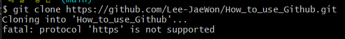

# GitHub 및 Git 사용 시 오류 해결 방안
깃허브와 연동 시 혹은 본인의 파일을 올릴 때 사소한 실수로 인해 오류가 발생하는 경우가 많다.

그러한 오류에 대해 다루어보자.

## 1. 주소 붙여넣기 오류 (fatal: protocol 'https' is not supported)
`git clone`이나 `git remote add origin`<br>
원하는 깃허브 주소에 있는 코드를 가져오고 싶거나, 깃허브의 내 저장소에 올릴 때 주소를 추가해주는 과정이 필요하다.


위와 같이 저장소에서 주소를 복사해온 뒤, 만약 이 저장소를 나의 로컬 저장소로 다운 받고 싶을 때, 다음과 같은 명령어를 사용한다.

```
git clone https://github.com/Lee-JaeWon/How_to_use_Github.git
```
이 때, 명령창에 git clone 을 입력한 후 주소를 붙여넣게 된다면 다음과 같은 오류가 생길 수 있다.


분명 주소도 그대로고 명령어도 틀린 것이 없지만, 무언가 지원하지 않는다는 문구를 출력하며 오류가 발생하였다.<br>
(이는 `git remote add origin`과정에서도 동일하게 발생한다.)
<br><br>
복사/붙여넣기를 잘 했다면 생기지 않았을 문제이지만, 가끔 복사를 잘못해오거나 붙여넣기를 잘못하면 발생한다.
<br><br>

위 에러를 텍스트로 확인하면 아래와 같다.<br>
```
$ git clone –https://github.com/Lee-JaeWon/How_to_use_Github.git
Cloning into 'How_to_use_Github'...
fatal: protocol '–https' is not supported
```
`https` 앞에 이상한 문자가 붙어있다는 것을 확인할 수 있다.<br>
이로 인해 git 명령어가 정상적으로 작동하지 않았던 것을 확인할 수 있으며, 수정해주면 다시 정상적으로 작동한다.<br><br>
사소한 복사/붙여넣기 지만 시간 버리지 않도록 잘 확인해서 이용하도록 하자.